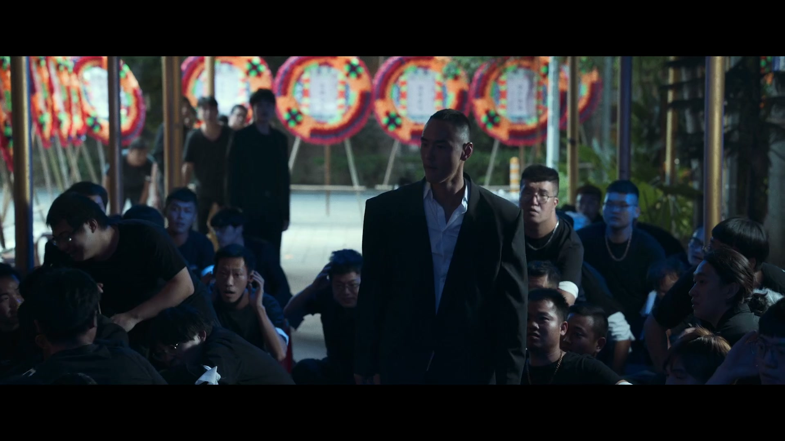
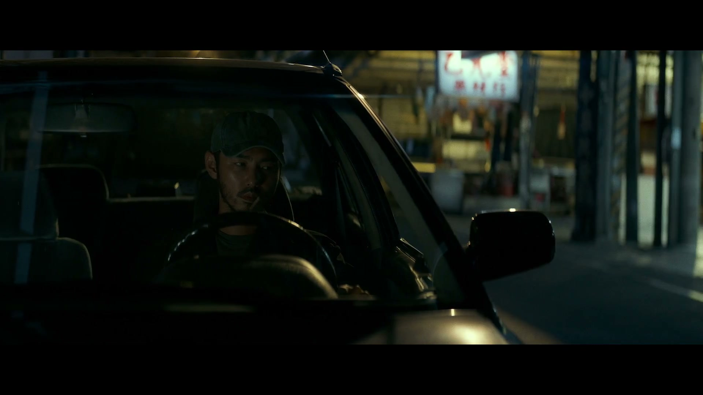
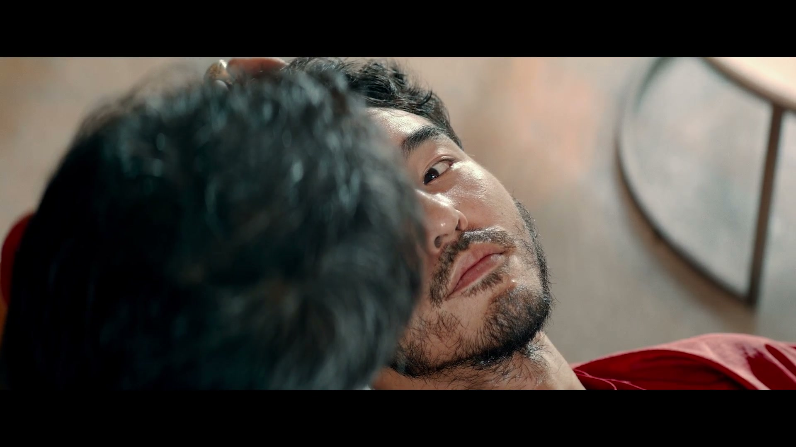

# Video Auto Snapshot / 视频自动截图

[English](#english) | [中文](#中文)

## English

Sample a local video, read its duration, and export 10 evenly spaced screenshots.
Prefer frames with people or faces when available.

This skill is designed for local video workflows in Codex:

- accept a local path or uploaded video
- probe duration
- sample 10 evenly spaced frames
- prefer a person or face when available
- write screenshots into a dedicated output folder

### Install

Copy the folder into your Codex skills directory:

```bash
~/.codex/skills/video-auto-snapshot
```

### Use

```text
$video-auto-snapshot /path/to/video.mp4
```

If you do not pass an output directory, the skill creates:

```text
<video-stem>-截图/
  shots/
  result.json
  contact-sheet.jpg
```

### Example

The contact sheet below was generated from `周处除三害.mp4`.


Selected frames:






### Contents

- `SKILL.md`: skill instructions
- `agents/openai.yaml`: UI metadata
- `scripts/video-auto-snapshot`: one-line CLI entry
- `scripts/video_auto_snapshot.py`: main implementation
- `references/video-workflow.md`: sampling policy
- `INSTALL.md`: minimal install note

---

## 中文

用于处理本地视频：读取时长，按均匀间隔导出 10 张截图，并在可用时优先选择有人像或人脸的画面。

这个 skill 适合在 Codex 里做本地视频流程：

- 传入本地路径或上传视频
- 先探测时长
- 均匀采样 10 帧
- 优先有人像/人脸的帧
- 把截图写到独立输出目录

### 安装

把整个文件夹复制到 Codex skills 目录：

```bash
~/.codex/skills/video-auto-snapshot
```

### 使用

```text
$video-auto-snapshot /path/to/video.mp4
```

如果不传输出目录，会自动创建：

```text
<视频名>-截图/
  shots/
  result.json
  contact-sheet.jpg
```

### 示例

下面的 contact sheet 来自 `周处除三害.mp4`：


部分截图：


### 目录内容

- `SKILL.md`：技能说明
- `agents/openai.yaml`：UI 元数据
- `scripts/video-auto-snapshot`：单命令入口
- `scripts/video_auto_snapshot.py`：主实现
- `references/video-workflow.md`：采样规则
- `INSTALL.md`：简短安装说明
